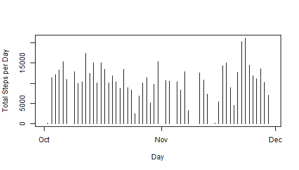
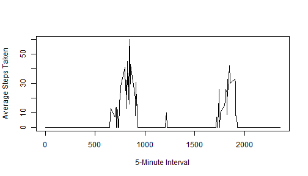
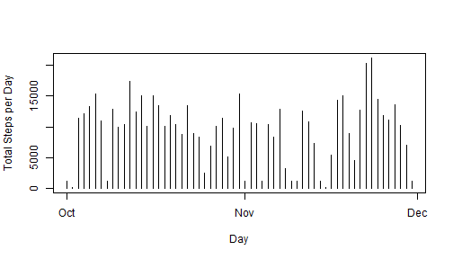
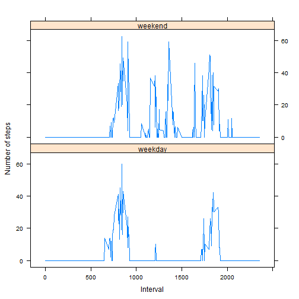

Reproducible Research: Peer Assessment 1
========================================================

## Loading and preprocessing the data
First we load the data and convert the date column to POSIXlt:

```r
data <- read.csv("repdata_data_activity/activity.csv")
data$date <- strptime(data$date, format = "%Y-%m-%d")
```

Now we will load the library **doBy** to help summarize data:

```r
library("doBy")
```

Summarize the data: 

```r
cdata <- summaryBy(steps ~ date, data = data, FUN = c(sum))
```

Then make a histogram of the total number of steps taken each day:

```r
plot(cdata$date, cdata$steps.sum, type = "h", ylab = "Total Steps per Day", 
    xlab = "Day")
```

 

## What is mean total number of steps taken per day?
The mean total number of steps taken per day is found and reported using the following code:

```r
m <- mean(cdata$steps.sum, na.rm = "true")
m2 <- median(cdata$steps.sum, na.rm = "true")
cat(paste(" The mean is: \n", m, "\n The median is: \n", m2))
```

```
##  The mean is: 
##  10766.1886792453 
##  The median is: 
##  10765
```

## What is the average daily activity pattern?
A time series plot showing the average daily activity pattern:

```r
## Define NA-stripping mean function.
mean2 <- function(x) {
    median(x, na.rm = "TRUE")
}
## Summarize data, then plot.
cdata2 <- summaryBy(steps ~ interval, data = data, FUN = c(mean2))
plot(cdata2$interval, cdata2$steps.mean2, type = "l", ylab = "Average Steps Taken", 
    xlab = "5-Minute Interval")
```

 

## Inputting missing values
We are asked to devise a strategy for replacing missing values.
I chose to **insert the mean for that 5-minute interval**.

First we calculate and report the total number of missing values (i.e. the total number of rows with NAs):

```r
nas <- subset(data, is.na(data))
cat(paste(" The number of rows with missing values is: \n", nrow(nas)))
```

```
##  The number of rows with missing values is: 
##  2304
```

Now, create new dataset using the above-mentioned strategy:

```r
ndata <- data
ind <- which(is.na(ndata), arr.ind = TRUE)
num <- nrow(ind)
for (i in 1:num) {
    row <- ind[i, 1]
    interval <- ndata[row, 3]
    row2 <- match(interval, cdata2[, 1])
    ndata[row, 1] <- cdata2[row2, 2]
}
```

We repeat our histogram for the new data, and also the previous for easy visual comparison:

```r
ncdata <- summaryBy(steps ~ date, data = ndata, FUN = c(sum))
plot(ncdata$date, ncdata$steps.sum, type = "h", ylab = "Total Steps per Day", 
    xlab = "Day")
```

 

```r
## Repeat Previous for comparison:
plot(cdata$date, cdata$steps.sum, type = "h", ylab = "Total Steps per Day", 
    xlab = "Day")
```

 

*We can see that data has been added in areas that were previously empty.*

Now, calculate and report the mean and median total number of steps taken per day:

```r
m <- mean(ncdata$steps.sum, na.rm = "true")
m2 <- median(ncdata$steps.sum, na.rm = "true")
cat(paste(" The mean is: \n", m, "\n The median is: \n", m2))
```

```
##  The mean is: 
##  9503.86885245902 
##  The median is: 
##  10395
```


*Do these values differ from the estimates from the first part of the assignment?*

Yes. The mean decreased from 10766.19 to 9503.87, and the median from 10765 to 10395.

*What is the impact of inputting missing data on the estimates of the total daily number of steps?*

The missing data increases the total daily number.

## Are there differences in activity patterns between weekdays and weekends?
Create a new factor variable in the dataset with two levels - "weekday" and "weekend" indicating whether a given date is a weekday or weekend day:

```r
days <- weekdays(ndata[, 2], abbreviate = "true")
days <- gsub("Mon", "weekday", days)
days <- gsub("Tue", "weekday", days)
days <- gsub("Wed", "weekday", days)
days <- gsub("Thu", "weekday", days)
days <- gsub("Fri", "weekday", days)
days <- gsub("Sat", "weekend", days)
days <- gsub("Sun", "weekend", days)
ndata2 <- cbind(ndata, days)
```

Make a panel plot containing a time series plot (i.e. type = "l") ## of the 5-minute interval (x-axis) and the average number of steps taken, averaged across all weekday days or weekend days (y-axis):

```r
library(lattice)
weekdays <- subset(ndata2, days == "weekday")
weekends <- subset(ndata2, days == "weekend")
weekdays2 <- summaryBy(steps ~ interval, data = weekdays, FUN = c(mean2))
weekends2 <- summaryBy(steps ~ interval, data = weekends, FUN = c(mean2))
weekdays3 <- cbind(weekdays2, "weekday")
weekends3 <- cbind(weekends2, "weekend")
colnames(weekends3)[3] <- "days"
colnames(weekdays3)[3] <- "days"
daysdata <- rbind(weekdays3, weekends3)
lattice.options(layout = c(2, 1))
xyplot(steps.mean2 ~ interval | days, data = daysdata, type = "l", layout = c(1, 
    2), xlab = "Interval", ylab = "Number of steps")
```

 


